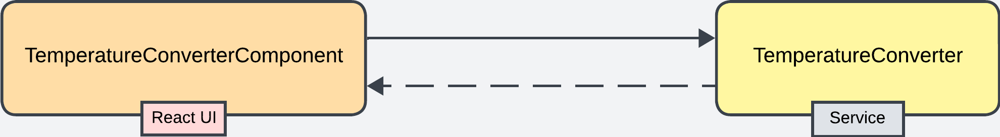

# Temperature Converter [](https://github.com/dfratte/temperature-converter/actions/workflows/main.yml)

This application is a simple temperature converter built with React. It allows users to convert temperatures between Celsius, Fahrenheit, and Kelvin.

## How It Works

The application consists of a single React component that manages the entire conversion process. We simulate the call to an independent service to do the actual conversion. That logic is contained in the TemperatureConverter.js file.



1. **User Input:** The user selects the input temperature scale (Celsius, Fahrenheit, or Kelvin) and enters the temperature value they want to convert.

2. **Temperature Conversion:** When the user enters a temperature value, the application automatically converts this value to the other two temperature scales. The conversion formulas are as follows:
    - Celsius to Fahrenheit: `(celsius * 9/5) + 32`
    - Celsius to Kelvin: `celsius + 273.15`
    - Fahrenheit to Celsius: `(fahrenheit - 32) * 5/9`
    - Fahrenheit to Kelvin: `((fahrenheit - 32) * 5/9) + 273.15`
    - Kelvin to Celsius: `kelvin - 273.15`
    - Kelvin to Fahrenheit: `((kelvin - 273.15) * 9/5) + 32`

3. **Display Results:** The converted temperature values are then displayed to the user.

## How to Use

To use the temperature converter, follow these steps:

1. Select the input temperature scale.
2. Enter the temperature value you want to convert.
3. The converted temperature values will automatically be displayed in the other two temperature scales.

## Installation

1. Clone the repository:
    ```bash
    git clone https://github.com/<username>/<repository>.git
    ```
    Replace `<username>` and `<repository>` with your GitHub username and repository name.

2. Navigate to the project directory:
    ```bash
    cd <repository>
    ```

3. Install the dependencies:
    ```bash
    npm install
    ```

4. Start the application:
    ```bash
    npm start
    ```

The application will start on `http://localhost:3000`.

## Testing

To run the tests, use the following command:

```bash
npm test